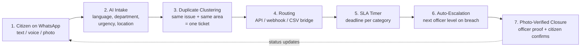
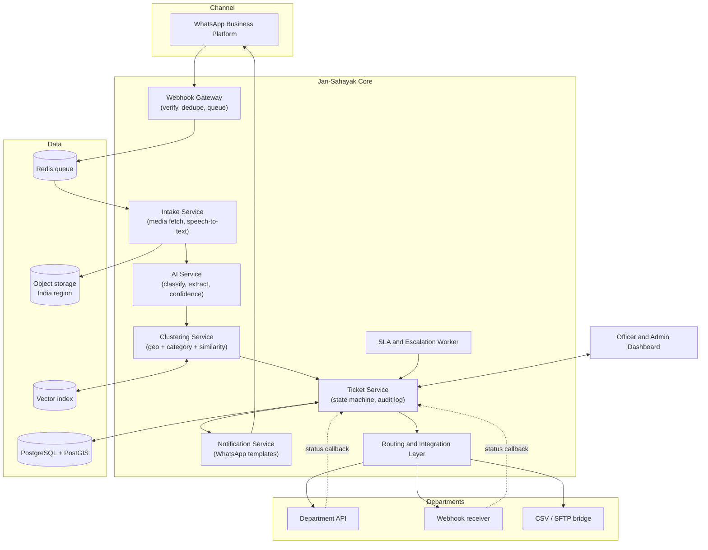
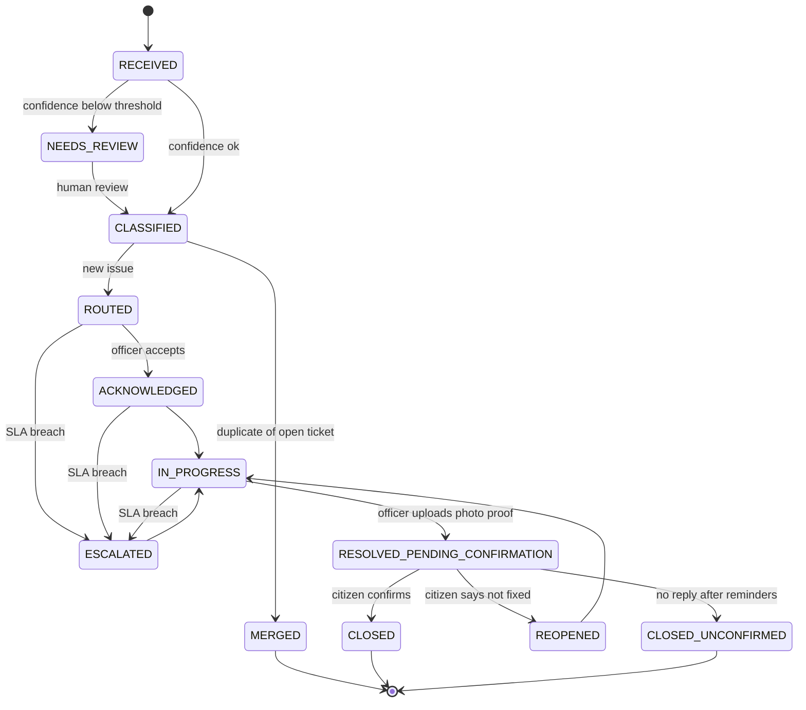
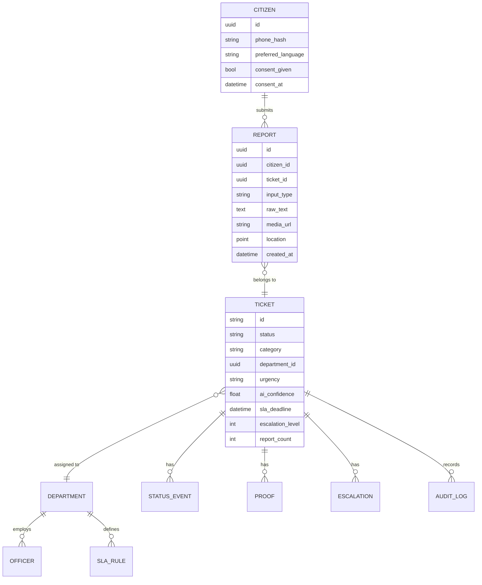

# Jan-Sahayak

**A WhatsApp-first grievance system that officers can actually run.**

Citizens complain where they already are. Officers keep the systems they already use.


---

## Table of contents

1. [The problem](#1-the-problem)
2. [The solution in one minute](#2-the-solution-in-one-minute)
3. [Key features](#3-key-features)
4. [How it works end to end](#4-how-it-works-end-to-end)
5. [Architecture](#5-architecture)
6. [Ticket lifecycle](#6-ticket-lifecycle)
7. [How Jan-Sahayak is different](#7-how-jan-sahayak-is-different)
8. [Tech stack](#8-tech-stack)
9. [Repository structure](#9-repository-structure)
10. [Getting started](#10-getting-started)
11. [Configuration](#11-configuration)
12. [API reference](#12-api-reference)
13. [Data model](#13-data-model)
14. [AI components](#14-ai-components)
15. [Department integration](#15-department-integration)
16. [Officer dashboard](#16-officer-dashboard)
17. [Security, privacy and compliance](#17-security-privacy-and-compliance)
18. [Pilot plan](#18-pilot-plan)
19. [Success metrics](#19-success-metrics)
20. [Risks and mitigations](#20-risks-and-mitigations)
21. [Testing](#21-testing)
22. [Roadmap](#22-roadmap)
23. [Contributing](#23-contributing)
24. [Team](#24-team)
25. [FAQ](#25-faq)
26. [License](#26-license)

---

## 1. The problem

Citizens in India report civic problems such as broken streetlights, garbage, water leaks and potholes. The reporting experience is poor and the follow-through is weaker.

| Pain point | What happens today |
|---|---|
| Friction for citizens | Separate apps, portals, logins and forms. Many citizens, especially those with low digital literacy, never complete a complaint. |
| Language barrier | Most portals expect English or formal Hindi. Real people write in Hinglish, dialects or send voice notes. |
| Manual sorting | Staff read each complaint and decide the department by hand. This is slow and error-prone. |
| Duplicate flood | One broken pipe can generate dozens of complaints. Officers see dozens of tickets for one problem. |
| No deadline pressure | Complaints sit unseen because nothing forces escalation. |
| "Closed on paper" | Tickets get closed without the work being done, and the citizen has no say. |
| Tool fatigue for officers | Replacing a department's existing system means migration, retraining and resistance. |

## 2. The solution in one minute

Jan-Sahayak is a closed-loop grievance layer that sits between citizens on WhatsApp and the systems departments already use.

1. A citizen sends a **text, voice note or photo** on WhatsApp in Hindi, English or Hinglish.
2. **AI** reads it and extracts language, department, urgency and location.
3. **Duplicate clustering** merges the same issue in the same area into one ticket.
4. The ticket is **routed** into the department's existing system (API, webhook or CSV bridge).
5. An **SLA timer** starts, with a deadline per complaint category.
6. If the deadline is missed, the ticket **auto-escalates** to the next officer level.
7. The officer uploads **photo proof**, the citizen **confirms** on WhatsApp, and only then does the ticket close.

Every step is logged. Every status change reaches the citizen on WhatsApp.

> Citizens get a WhatsApp-first experience. Officers keep familiar systems.

## 3. Key features

### For citizens
- No app download, no portal login, no form.
- Text, voice note and photo input.
- Hindi, English and Hinglish understood.
- Location from a WhatsApp location pin, or extracted from the message text.
- Ticket ID and status updates sent back on the same chat.
- A final confirmation step: "Is this fixed?" before closure.

### For officers and departments
- Tickets arrive in the system the department already uses.
- One clustered ticket instead of many duplicates, with a count of how many citizens reported it.
- Pre-tagged department, category and urgency, with a confidence score.
- SLA countdown and escalation history on every ticket.
- Photo-proof upload from a mobile browser.

### For administrators
- Dashboard with SLA compliance, response time, duplicate reduction and closure metrics.
- Configurable SLA rules, escalation chains and category taxonomy.
- Review queue for low-confidence AI classifications.
- Full audit trail, exportable.

## 4. How it works end to end



### Example conversation

```
Citizen : [voice note in Hinglish] "Bhai, mohalle ki street light 3 din se band hai, andhera rehta hai"
          [location pin shared]

Jan-Sahayak : Aapki shikayat mil gayi hai. Ticket JS-2026-004217
              Vibhag: Street Lighting | Priority: Normal
              Hum 24 ghante mein update denge.

(later)
Jan-Sahayak : Update: Officer ne aapki shikayat accept kar li hai.

(after fix)
Jan-Sahayak : Kaam ho gaya hai. Photo dekhiye. [photo]
              Kya problem solve ho gayi? Reply: 1 = Haan, 2 = Nahi

Citizen : 1
Jan-Sahayak : Dhanyavaad. Ticket JS-2026-004217 band kar diya gaya hai.
```

## 5. Architecture



### Design principles

- **Plug in, do not replace.** Departments keep their systems. Jan-Sahayak adapts to them.
- **AI suggests, officer decides.** Low-confidence results go to human review.
- **Closed loop.** No ticket closes without proof and citizen confirmation.
- **Everything is auditable.** Each state change, AI decision and message is logged.
- **Configuration over code.** Categories, SLAs and escalation chains are data, not hard-coded.

## 6. Ticket lifecycle



**Closure rules**

- A ticket cannot move to `RESOLVED_PENDING_CONFIRMATION` without at least one proof photo.
- A ticket moves to `CLOSED` only on citizen confirmation.
- If the citizen does not reply, reminders are sent. After the reminder window the ticket is marked `CLOSED_UNCONFIRMED`. These are tracked separately and **do not count** toward the citizen-confirmed closure metric.
- If the citizen says the issue is not fixed, the ticket is reopened and the escalation history is kept.

## 7. How Jan-Sahayak is different

Comparison is by type of system, not by specific product.

| Feature | Typical portal / app | Helpline / call centre | Jan-Sahayak |
|---|---|---|---|
| No app download or login needed | No | Yes | Yes |
| Text, voice note and photo input | Partial | Voice only | Yes |
| Hindi, English and Hinglish understood | Partial | Partial | Yes |
| AI auto-tags department and urgency | No | No | Yes |
| Duplicate complaints merged into one ticket | No | No | Yes |
| Auto-escalation when deadline is missed | Partial | No | Yes |
| Photo proof required before closure | No | No | Yes |
| Citizen confirms the fix before closing | No | No | Yes |
| Works with the department's existing system | No | No | Yes |

**What is new here**

1. **Closed-loop closure.** A ticket closes only after photo proof and citizen confirmation.
2. **Duplicate clustering.** Same issue in the same area becomes one ticket.
3. **Plug-in, not replace.** Connects through API, webhook or CSV bridge. No retraining, no migration.
4. **Accountable AI.** AI suggests, officer decides. Full audit trail.

## 8. Tech stack

The stack below is the **reference implementation**. Each AI and infrastructure component is behind an interface so it can be swapped.

| Layer | Choice | Notes |
|---|---|---|
| Messaging | WhatsApp Business Platform (Cloud API) | Opt-in messaging only, approved templates for outbound |
| Backend API | Python, FastAPI | Async, typed, OpenAPI docs out of the box |
| Workers | Celery or RQ with Redis | Media processing, SLA timers, notifications |
| Database | PostgreSQL with PostGIS | Geo queries for clustering and ward mapping |
| Vector search | pgvector | Text-embedding similarity for duplicate detection |
| Speech to text | Pluggable provider | Must support Hindi and Hinglish |
| LLM classification | Pluggable provider | Structured JSON output with confidence |
| Object storage | S3-compatible, India region | Citizen photos, voice notes, proof photos |
| Dashboard | React with TypeScript | Officer and admin views |
| Auth | JWT with role-based access control | Roles: citizen (via phone), officer, supervisor, admin |
| Packaging | Docker and Docker Compose | One command local setup |
| CI | GitHub Actions | Lint, tests, build |

## 9. Repository structure

```
jan-sahayak/
├── README.md
├── LICENSE
├── docker-compose.yml
├── .env.example
├── docs/
│   ├── architecture.md
│   ├── api.md
│   ├── data-model.md
│   ├── integration-guide.md
│   ├── sla-and-escalation.md
│   ├── privacy-and-compliance.md
│   ├── pilot-plan.md
│   └── images/
├── backend/
│   ├── app/
│   │   ├── main.py
│   │   ├── config.py
│   │   ├── api/                  # REST routes
│   │   │   ├── webhooks.py       # WhatsApp webhook
│   │   │   ├── tickets.py
│   │   │   ├── departments.py
│   │   │   ├── admin.py
│   │   │   └── integrations.py
│   │   ├── services/
│   │   │   ├── intake.py         # media fetch, normalisation
│   │   │   ├── speech.py         # speech-to-text adapter
│   │   │   ├── classifier.py     # LLM classification adapter
│   │   │   ├── clustering.py     # duplicate detection
│   │   │   ├── routing.py        # department routing
│   │   │   ├── sla.py            # deadlines and escalation
│   │   │   ├── closure.py        # proof and confirmation flow
│   │   │   └── notify.py         # WhatsApp outbound messages
│   │   ├── integrations/
│   │   │   ├── base.py           # connector interface
│   │   │   ├── rest_api.py
│   │   │   ├── webhook.py
│   │   │   └── csv_bridge.py
│   │   ├── models/               # SQLAlchemy models
│   │   ├── schemas/              # Pydantic schemas
│   │   ├── workers/              # background jobs
│   │   └── core/                 # auth, logging, audit, i18n
│   ├── migrations/
│   └── tests/
├── dashboard/
│   ├── src/
│   │   ├── pages/
│   │   ├── components/
│   │   └── api/
│   └── package.json
├── config/
│   ├── categories.yaml           # category taxonomy
│   ├── sla_rules.yaml            # deadlines per category
│   ├── escalation_chains.yaml    # officer levels per department
│   ├── wards.geojson             # ward boundaries (pilot area)
│   └── message_templates/        # Hindi and English templates
├── scripts/
│   ├── seed_demo_data.py
│   └── simulate_whatsapp.py      # send fake WhatsApp events locally
└── .github/
    └── workflows/ci.yml
```

> Adjust this tree to match what is actually committed. Remove folders that do not exist yet.

## 10. Getting started

### Prerequisites

- Docker and Docker Compose
- Python 3.11 or newer (for running without Docker)
- Node.js 18 or newer (for the dashboard)
- A WhatsApp Business Platform account with a test phone number (optional for local demo, see below)

### Quick start with Docker

```bash
git clone https://github.com/<your-org>/jan-sahayak.git
cd jan-sahayak

cp .env.example .env
# edit .env and fill in the values (see Configuration)

docker compose up --build
```

Services started:

| Service | URL |
|---|---|
| Backend API | http://localhost:8000 |
| API docs (Swagger) | http://localhost:8000/docs |
| Dashboard | http://localhost:3000 |
| PostgreSQL | localhost:5432 |
| Redis | localhost:6379 |

### Seed demo data

```bash
docker compose exec backend python scripts/seed_demo_data.py
```

This loads sample departments, categories, SLA rules, officers and a few tickets.

### Run without WhatsApp credentials (local simulator)

You do not need a live WhatsApp number to try the flow. The simulator posts WhatsApp-style webhook payloads to your local backend.

```bash
docker compose exec backend python scripts/simulate_whatsapp.py \
  --from +910000000001 \
  --text "Mohalle ki street light 3 din se band hai" \
  --lat 23.2599 --lng 77.4126
```

### Run services manually (without Docker)

```bash
# backend
cd backend
python -m venv .venv && source .venv/bin/activate
pip install -r requirements.txt
alembic upgrade head
uvicorn app.main:app --reload --port 8000

# worker (separate terminal)
celery -A app.workers.celery_app worker --loglevel=info

# dashboard (separate terminal)
cd dashboard
npm install
npm run dev
```

### Connect a real WhatsApp number

1. Create a WhatsApp Business Platform app and obtain a phone number ID and access token.
2. Expose your local backend with a tunnel (for example, ngrok) so Meta can reach it.
3. Set the webhook URL to `https://<public-url>/api/webhooks/whatsapp` and use your `WHATSAPP_VERIFY_TOKEN`.
4. Subscribe to the `messages` webhook field.
5. Register your outbound message templates (see `config/message_templates/`).

## 11. Configuration

Copy `.env.example` to `.env`. Never commit `.env`.

| Variable | Required | Description |
|---|---|---|
| `APP_ENV` | yes | `development` or `production` |
| `SECRET_KEY` | yes | Signing key for JWTs |
| `DATABASE_URL` | yes | PostgreSQL connection string |
| `REDIS_URL` | yes | Redis connection string |
| `WHATSAPP_PHONE_NUMBER_ID` | for live | WhatsApp phone number ID |
| `WHATSAPP_ACCESS_TOKEN` | for live | Access token for the Cloud API |
| `WHATSAPP_VERIFY_TOKEN` | for live | Token used for webhook verification |
| `WHATSAPP_APP_SECRET` | for live | Used to verify webhook signatures |
| `LLM_PROVIDER` | yes | Name of the classification provider adapter |
| `LLM_API_KEY` | yes | Key for the chosen provider |
| `STT_PROVIDER` | yes | Name of the speech-to-text adapter |
| `STT_API_KEY` | yes | Key for the chosen provider |
| `STORAGE_ENDPOINT` | yes | S3-compatible endpoint (India region) |
| `STORAGE_BUCKET` | yes | Bucket for media |
| `STORAGE_ACCESS_KEY` / `STORAGE_SECRET_KEY` | yes | Storage credentials |
| `CLASSIFY_CONFIDENCE_THRESHOLD` | no | Default `0.70`. Below this, ticket goes to human review |
| `CLUSTER_RADIUS_METERS` | no | Default `100` |
| `CLUSTER_WINDOW_DAYS` | no | Default `7` |
| `CLUSTER_SIMILARITY_THRESHOLD` | no | Default `0.80` |
| `CONFIRMATION_REMINDER_HOURS` | no | Default `48` |
| `DATA_RETENTION_DAYS` | no | Retention period for media and personal data |

The numeric defaults above are starting points. Tune them using pilot data.

## 12. API reference

Full interactive docs are served at `/docs`. Summary of the main endpoints:

### WhatsApp webhook

| Method | Path | Purpose |
|---|---|---|
| GET | `/api/webhooks/whatsapp` | Webhook verification handshake |
| POST | `/api/webhooks/whatsapp` | Incoming messages and delivery statuses |

### Tickets

| Method | Path | Purpose |
|---|---|---|
| GET | `/api/tickets` | List tickets with filters (status, department, ward, SLA state) |
| GET | `/api/tickets/{id}` | Ticket detail with timeline, reports and audit log |
| POST | `/api/tickets/{id}/acknowledge` | Officer accepts the ticket |
| POST | `/api/tickets/{id}/status` | Update status |
| POST | `/api/tickets/{id}/proof` | Upload proof photo(s) |
| POST | `/api/tickets/{id}/reclassify` | Human correction of department or category |
| POST | `/api/tickets/{id}/merge` | Manually merge or split clusters |

### Department integration

| Method | Path | Purpose |
|---|---|---|
| POST | `/api/integrations/{dept}/callback` | Status callback from a department system |
| GET | `/api/integrations/{dept}/export.csv` | CSV export for the CSV bridge |
| POST | `/api/integrations/{dept}/import` | CSV status import |

### Admin and analytics

| Method | Path | Purpose |
|---|---|---|
| GET | `/api/admin/metrics` | SLA compliance, response time, duplicate reduction, closure rate |
| GET | `/api/admin/review-queue` | Low-confidence tickets awaiting human review |
| GET/PUT | `/api/admin/sla-rules` | Read or update SLA rules |
| GET/PUT | `/api/admin/escalation-chains` | Read or update escalation chains |
| GET | `/api/admin/audit` | Audit log search and export |

### Example: ticket object

```json
{
  "id": "JS-2026-004217",
  "status": "ROUTED",
  "category": "street_lighting",
  "department": "electrical",
  "urgency": "normal",
  "ward": "Ward 12",
  "location": { "lat": 23.2599, "lng": 77.4126 },
  "report_count": 4,
  "ai": { "confidence": 0.91, "language": "hinglish", "needs_review": false },
  "sla": { "deadline": "2026-10-03T10:00:00+05:30", "state": "on_track" },
  "escalation_level": 0,
  "created_at": "2026-10-02T10:00:00+05:30"
}
```

## 13. Data model



Key points:

- Many `REPORT` rows can point to one `TICKET`. This is how duplicate clustering is stored.
- Phone numbers are stored hashed for lookups. The raw number is held only where needed to send messages, encrypted.
- Every state change writes a `STATUS_EVENT` and an `AUDIT_LOG` entry.

## 14. AI components

### 14.1 Intake and speech

- Text is normalised (script mixing, spelling variants, transliteration).
- Voice notes are transcribed with a speech-to-text adapter that supports Hindi and Hinglish.
- Photos are stored and passed to the classifier as extra context. They are also used as evidence on the ticket.

### 14.2 Classification

The classifier returns structured output:

```json
{
  "language": "hinglish",
  "category": "street_lighting",
  "department": "electrical",
  "urgency": "normal",
  "location_text": "mohalle ki street",
  "summary": "Street light not working for 3 days",
  "confidence": 0.91
}
```

- Output is validated against the category taxonomy in `config/categories.yaml`.
- Anything below `CLASSIFY_CONFIDENCE_THRESHOLD` goes to the review queue.
- Urgency rules include a deterministic safety layer. For example, keywords related to live wires, open manholes or flooding raise urgency regardless of the model output.
- The system never closes, rejects or downgrades a complaint on AI output alone.

### 14.3 Duplicate clustering

A new report is merged into an existing open ticket when all of these hold:

1. Same category (or a configured related category).
2. Location within `CLUSTER_RADIUS_METERS`.
3. Created within `CLUSTER_WINDOW_DAYS` of the existing open ticket.
4. Text similarity above `CLUSTER_SIMILARITY_THRESHOLD`.

Merged citizens are still notified about the ticket status. The officer sees a single ticket with `report_count`.

### 14.4 Responsible AI notes

- AI suggests, the officer decides.
- Every AI output is stored with its confidence and the model/version that produced it.
- Corrections by humans are logged and can be used to evaluate and improve prompts and thresholds.
- Evaluate on a labelled Hindi/Hinglish set before the pilot, and report per-category accuracy.

## 15. Department integration

Departments connect through whichever method fits their system. All three produce the same internal ticket events.

| Method | When to use | How it works |
|---|---|---|
| **REST API** | Department system exposes an API | Jan-Sahayak creates and updates tickets by API |
| **Webhook** | Department can receive HTTP callbacks | Jan-Sahayak pushes ticket events, department posts status back to `/callback` |
| **CSV bridge** | Legacy or offline system | Scheduled CSV export and import over a shared location or SFTP |

To add a new connector, implement the interface in `backend/app/integrations/base.py`:

```python
class DepartmentConnector:
    def create_ticket(self, ticket: Ticket) -> ExternalRef: ...
    def update_ticket(self, ticket: Ticket) -> None: ...
    def fetch_status_updates(self, since: datetime) -> list[StatusUpdate]: ...
```

See `docs/integration-guide.md` for field mapping and a worked example.

### SLA and escalation (example configuration)

Deadlines are configured per category in `config/sla_rules.yaml`. The values below are **illustrative defaults for the pilot**, to be agreed with each department.

| Category | Acknowledge within | Resolve within | Escalation on breach |
|---|---|---|---|
| Street lighting | 4 hrs | 72 hrs | Level 1 then Level 2 |
| Garbage not collected | 4 hrs | 48 hrs | Level 1 then Level 2 |
| Water supply or leak | 4 hrs | 24 hrs | Level 1 then Level 2 |
| Pothole or road damage | 4 hrs | 7 days | Level 1 then Level 2 |
| Safety-critical (live wire, open manhole) | 1 hr | 12 hrs | Immediate Level 2 |

```yaml
# config/escalation_chains.yaml (example)
electrical:
  - level: 0
    role: junior_engineer
  - level: 1
    role: assistant_engineer
  - level: 2
    role: executive_engineer
```

## 16. Officer dashboard

- **Inbox:** tickets by department, ward, status and SLA state.
- **Ticket view:** merged reports, map pin, photos, AI tags with confidence, full timeline.
- **Proof upload:** mobile-friendly page to capture and upload the fix photo.
- **Review queue:** low-confidence tickets for human tagging.
- **Metrics:** first-response time, SLA compliance, duplicate reduction, citizen-confirmed closure, satisfaction.
- **Admin:** categories, SLA rules, escalation chains, user roles.

## 17. Security, privacy and compliance

| Area | Approach |
|---|---|
| Personal data law | Designed to follow India's Digital Personal Data Protection Act, 2023: consent, purpose limitation, data minimisation |
| Consent | Explicit opt-in captured on first message and stored with timestamp |
| WhatsApp policy | WhatsApp Business Platform policy followed. Opt-in messaging only. Approved templates for outbound messages outside the service window |
| Data residency | Data stored in India-region cloud |
| Encryption | TLS in transit. Encryption at rest for database and object storage |
| Access control | Role-based access. Officers see only their department and ward |
| Phone numbers | Hashed for lookup, encrypted where needed for messaging |
| Webhook security | Signature verification, replay protection, rate limiting |
| Audit | Full audit trail on every ticket and every AI decision |
| Retention | Configurable retention and deletion workflow (`DATA_RETENTION_DAYS`) |
| Human oversight | AI suggests, officer decides |

> This section describes the intended design. A formal legal and security review is recommended before any production deployment.

To report a security issue, please do not open a public issue. Email `<security-contact@example.org>`.

## 18. Pilot plan

A 12-week pilot with measurable outcomes.

| Phase | Weeks | Focus |
|---|---|---|
| 1. Setup | 1-2 | WhatsApp Business API, department mapping, SLA rules |
| 2. Build | 3-4 | AI classification, clustering, dashboard, integration |
| 3. Pilot | 5-10 | Live pilot in 1 ward with 3 departments (water, roads and streetlights, sanitation) |
| 4. Review | 11-12 | Metrics, audit, scale-up proposal |

**Pilot team**

| Role | Count |
|---|---|
| Product and AI lead | 1 |
| Backend engineer | 2 |
| Integration / field coordinator | 1 |
| Department liaison | 1 |

**Pilot budget (estimate)**

| Item | Amount |
|---|---|
| WhatsApp API and messaging | ₹60,000 |
| Cloud and AI inference | ₹90,000 |
| Team and field support | ₹2,50,000 |
| Contingency | ₹50,000 |
| **Total** | **₹4,50,000** |

Baselines for each metric are measured during the first two weeks and compared against pilot results.

## 19. Success metrics

These are **pilot targets**, not claims of current performance.

| Metric | Target |
|---|---|
| Average first-response time | Under 4 hrs |
| SLA compliance | Above 85% |
| Duplicate reduction (fewer repeat tickets) | 30% |
| Citizen-confirmed closure | Above 70% |
| Citizen satisfaction | 4 out of 5 |

## 20. Risks and mitigations

| Risk | Mitigation |
|---|---|
| Low digital literacy | Voice notes and Hindi/Hinglish support. No forms |
| AI misclassification | Confidence threshold. Human review below it. Safety keyword layer |
| Department resistance | No change to their system. We plug into it |
| Citizens do not confirm closure | Reminders, `CLOSED_UNCONFIRMED` state tracked separately, never counted as confirmed |
| Fake or spam complaints | Rate limits per number, duplicate detection, photo and location checks, officer flag |
| WhatsApp policy or cost changes | Messaging layer is an adapter, template usage minimised |
| Data misuse | Data minimisation, role-based access, audit trail, retention limits |

## 21. Testing

```bash
# backend tests
cd backend
pytest -q

# lint and type checks
ruff check .
mypy app

# dashboard tests
cd dashboard
npm test
```

Test layers:

- **Unit:** state machine transitions, SLA calculations, clustering rules.
- **Integration:** webhook to ticket creation using recorded WhatsApp payloads.
- **AI evaluation:** labelled Hindi/Hinglish set, per-category accuracy and confusion matrix.
- **End to end:** simulator-driven flow from first message to confirmed closure.

## 22. Roadmap

- [ ] WhatsApp webhook, ticket creation and status updates
- [ ] Text, voice and photo intake
- [ ] AI classification with confidence and review queue
- [ ] Duplicate clustering
- [ ] SLA timers and auto-escalation
- [ ] Photo-verified closure with citizen confirmation
- [ ] REST, webhook and CSV connectors
- [ ] Officer and admin dashboard
- [ ] Pilot deployment and metrics report
- [ ] More Indian languages
- [ ] Public ward-level transparency dashboard
- [ ] Multi-city rollout tooling

Update the checkboxes to reflect what is actually built.

## 23. Contributing

Contributions are welcome.

1. Fork the repository and create a branch: `git checkout -b feature/<short-name>`.
2. Make your change with tests.
3. Run lint and tests locally.
4. Open a pull request describing what changed and why.

Guidelines:

- Keep personal data out of logs, fixtures and screenshots.
- Never commit secrets. Use `.env`.
- Write commit messages in the imperative: "Add SLA breach worker".
- Be respectful in discussions.

## 24. Team

| Name | Role | Contact |
|---|---|---|
| `<name>` | Product and AI lead | `<email or GitHub>` |
| `<name>` | Backend engineer | `<email or GitHub>` |
| `<name>` | Backend engineer | `<email or GitHub>` |
| `<name>` | Integration / field coordinator | `<email or GitHub>` |
| `<name>` | Department liaison | `<email or GitHub>` |

## 25. FAQ

**Do citizens need to install anything?**
No. They message a WhatsApp number.

**Do departments have to change their software?**
No. Jan-Sahayak connects through API, webhook or CSV and writes status back.

**What if the AI gets it wrong?**
Low-confidence tickets go to human review, and officers can reclassify any ticket. AI never closes or rejects a complaint by itself.

**What stops tickets being closed without work being done?**
A ticket needs a proof photo from the officer and a confirmation from the citizen. Unconfirmed closures are tracked separately.

**How are duplicates handled?**
Reports with the same category, nearby location, recent time and similar text are merged into one ticket. Every reporting citizen still receives updates.

**Where is data stored?**
In an India-region cloud, encrypted, with role-based access.

**Are the numbers in this README real results?**
No. They are pilot targets and planning estimates. Results will be published after the pilot.

## 26. License

Released under the MIT License. See [LICENSE](LICENSE).

---

*Citizens get a WhatsApp-first experience. Officers keep familiar systems.*
